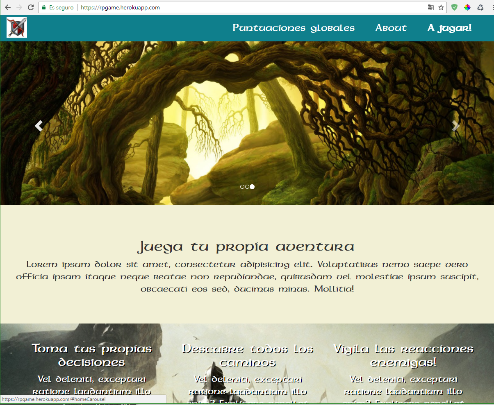
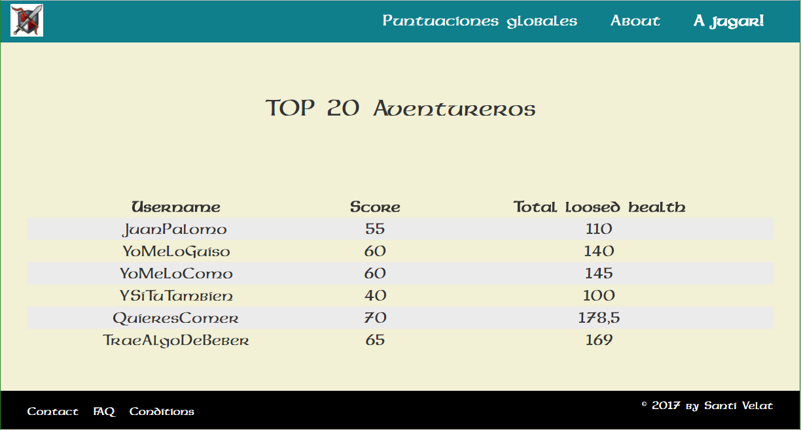
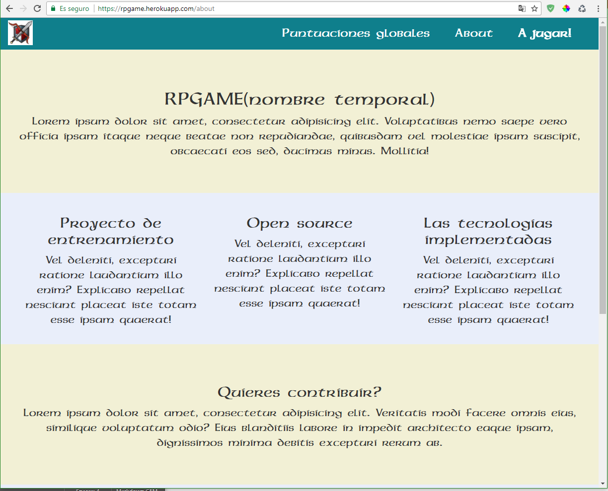
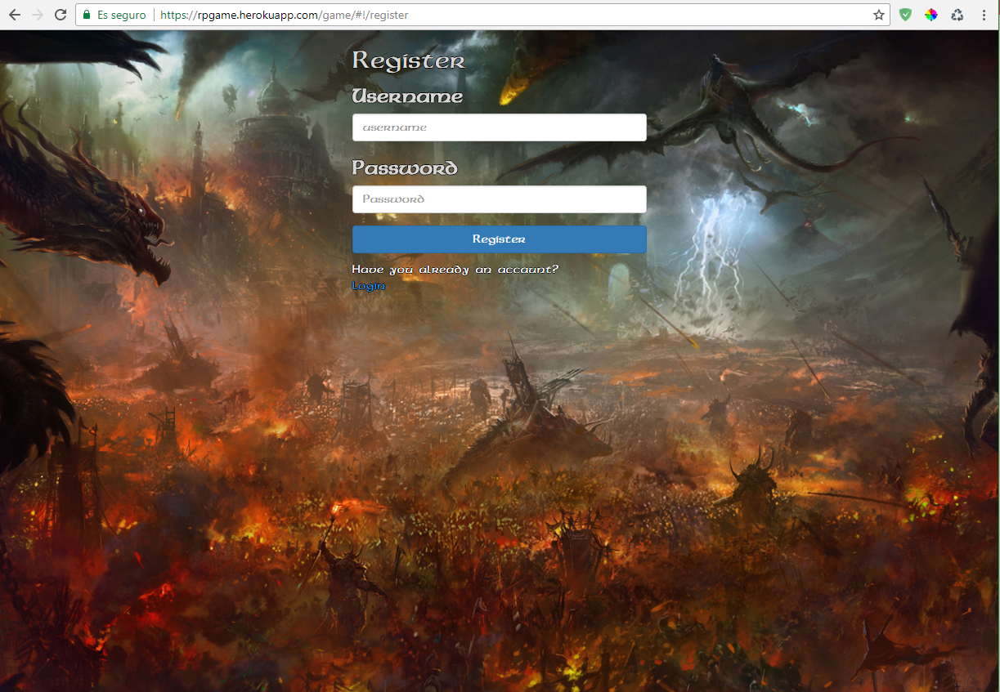
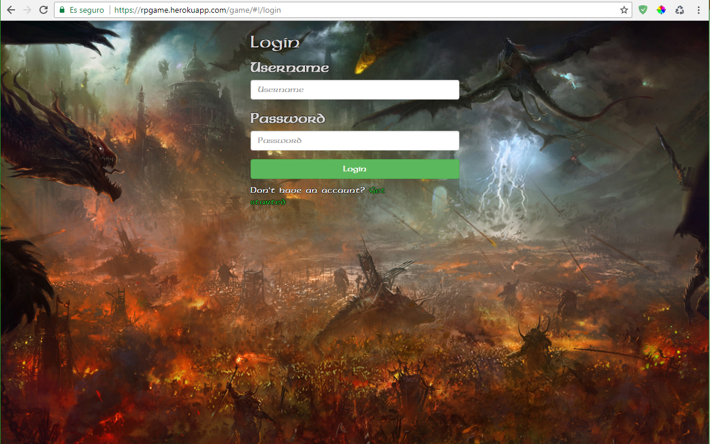
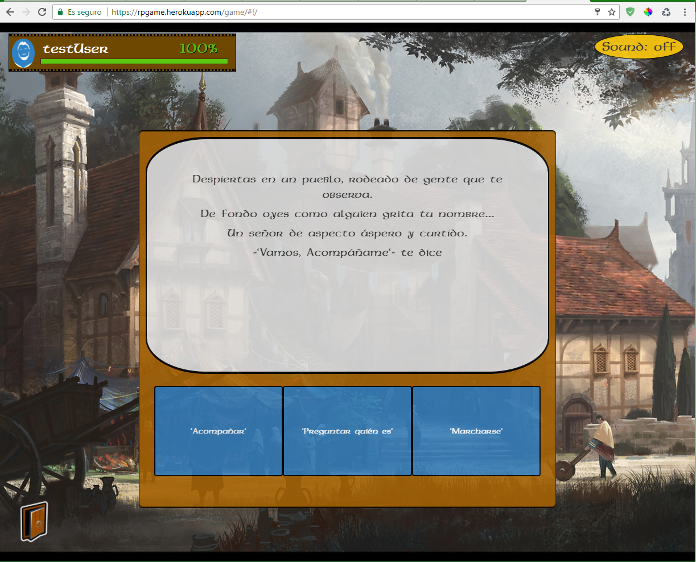
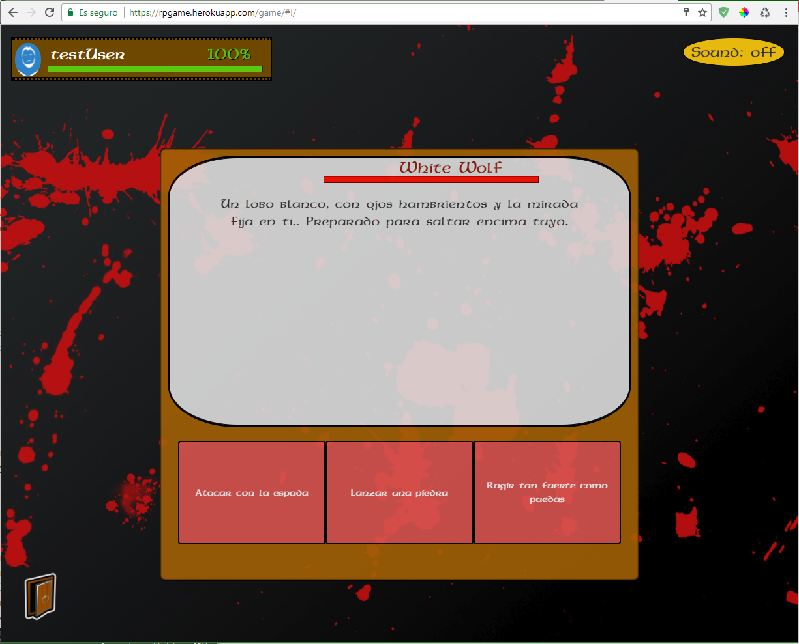
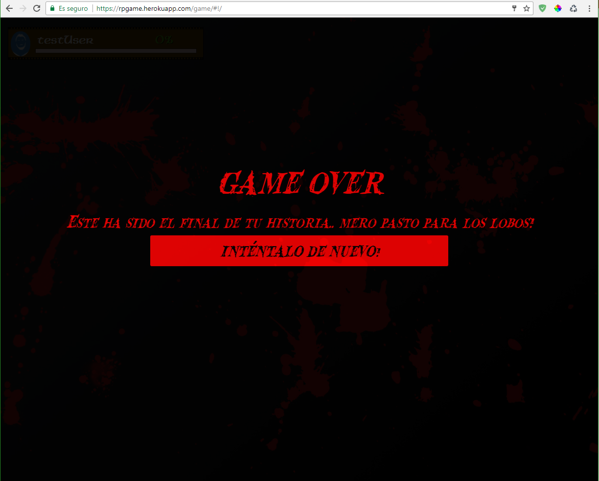

# RPGAME

[](https://nodejs.org/)
[](http://expressjs.com///)
[](https://angularjs.org/)
[](http://www.ecma-international.org/ecma-262/6.0/) 
[](https://www.npmjs.com/)
[](https://bower.io/)
[](https://www.mongodb.com/)
[]
[](http://www.w3.org/) 
[](https://github.com/feross/standard)

## [FULL STACK PROJECT]
[FULL STACK PROJECT]:https://rpgame.herokuapp.com
Check the functional version 1.0! All feedbacks will be welcomed!!

**Description**

rpGame is a self guided history. User can decide what to say, what to do and how to die!

rpGamer isn't a common game,the  user has a lot of ways and dialogs to decide.. And the logical way is not always the safest.

The app use a register/login system, which owns autosave for all progress on the game 


## Installation

You need to have installed [NodeJS](https://nodejs.org/) with [npm](https://www.npmjs.com/), [bower](https://bower.io/) and [MongoDB](https://www.mongodb.com/)

---
### Configuration `env` file

You need to create an **.env** file in the project root with the following environment variables configured:

- Port:

  ```
  PORT=XXXX
  ```

- Mongodb path and database to use:

  ```
  URL_DB=mongodb://localhost:27017/NAME_DB
  ```
  
- Secret word to encrypt users' passwords:

  ```
  SECRET=XXXXXXXXXX
  ```


### To run the server:

```
$ npm start
```

All dependencies will be installed automatically

### To run in dev mode:

```
$npm run dev
```

## API

The server part has multiple **API endpoints** using several routes:

- `/api` -> Serves the internal data of the users and players.
- `/auth` -> Serves the authentication options, register and login for user and admin

---

## Built with:

- **Front-end**

    - angular: 1.6.6
      - angular-router: 0.4.2
      - angular-jwt: 0.1.9
      - angular-sanitize: 1.6.6
      - angularJS-Toaster: angularjs-toaster#2.2.0
    - bootstrap: 3.3.7
    - bower: 1.8.0

- **Back-end**

    - async: 2.5.0,
    - body-parser: 1.17.2,
    - bower: 1.8.0,
    - express: 4.15.4,
    - fs-readfile-promise: 3.0.0,
    - mongodb: 2.2.31,
      - mongoose: 4.7.1,
    - passport: 0.4.0,
      - passport-jwt: 3.0.0,
      - passport-local: 1.0.0,
      - passport-local-mongoose: 4.2.1,
    - pug: 2.0.0-rc.3


---

**Pages**

* Home

Explicative page, game presentation and basic knowledges 



* Global-scores

Here are the top gamers, who have done largest ways keeping them alive



* About

Explication page, introduces the creator, the objectives and let open gates to know people with new initiatives



* Register

Register page, need to cross it to start playing, but anyway is a non-intrusive register, just username and password 



* Login

Login page, usual comprobation of user and password made with passport. This step is also used to storage a token on client machine. Preventing users to make repetitive logins.



* Game

Game view, character information on top left. Enable/Disable game music with the top-right button. Logout button on left-bottom. And saving game indicatior on bottom-right.

The middle of the screen is reserved for the history and decision interfaces.



* Combat

Respects the same structure than game page, but enemy health has her place on the middle, next no the enemy name..



* Game Over

Game over page, really seen on that game. Once you enter on game-over stage, there is no way for go back. User should start from the beginning if he wants keep playing 




* Bugs detected on version 1.0
  - Pressing Disable/Enable music on combat stage will play the town(non-combat) song.
  - Leaving the game during a combat will produce the enemy health restore


## Author

[Santi Velat](https://github.com/SantiVelat/)


